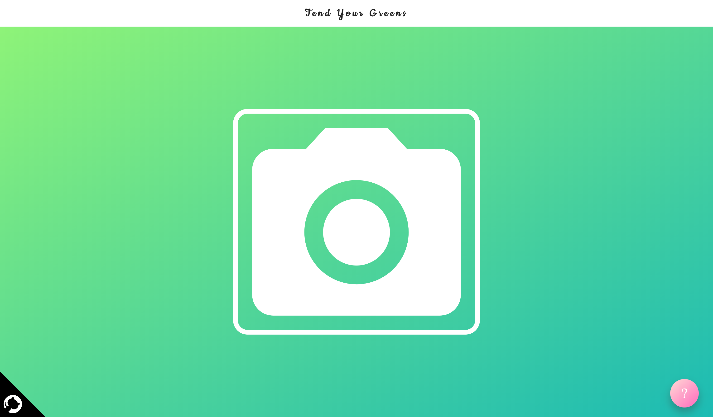
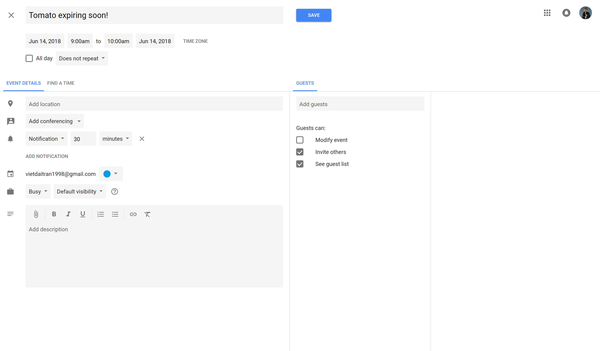

# Tend Your Greens (Deprecated)
A web app that adds reminders to your calendar to let you know when your groceries expire!

# Note
Google has changed their vision API, making it no longer compatible with our application.

## How To Use
* upload a photo from your phone or desktop
* website will redirect you to a generated calendar event






## Local Installation

You'll need NodeJS to run this project. After cloning the repository:
```
npm install
```

To start up the server:
```
npm start
```

Then go to your browser and point it to localhost on the appropriate port.
